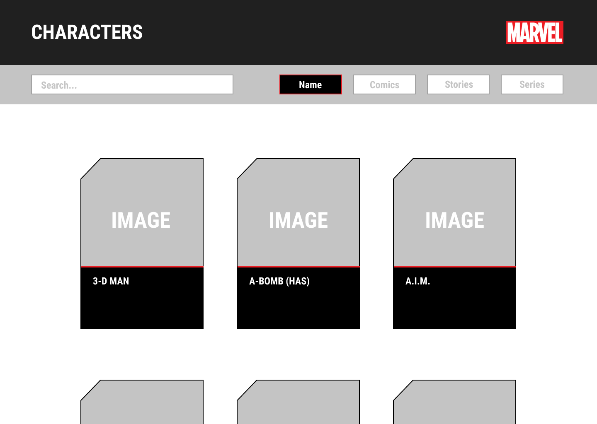
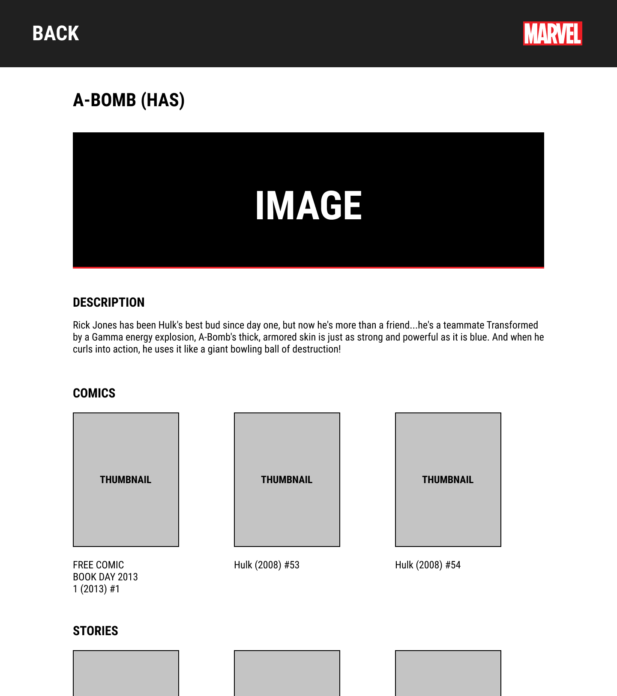

# MediaMonks challenge

## Para iniciar

- Para instalar ir al directorio `/marvel-mediamonks` y ejecutar:

  ```
  npm install
  ```

- Una vez finalizada la instalación ejecutar:
  ```
  npm start
  ```

# Funcionamiento

La estructura general de componentes es:

> Home > Card > CharacterDetail

Al iniciar la app, se hace 1 request al endpoint "/v1/public/characters/" ordenados por orden alfabetico y con un limite de 50 (para simplificar). La respuesta se almacenan en el store de Redux (de ahora en adelante solo se utiliza lo almacenado).

El componente Home muestra los componentes de SearchBar (que contiene ademas los botones de filtrado) y un listado de componente Cards por cada personaje que hay almacenado en el store.
Los botones de filtrado setean el store en "name", "comics", "stories" y "series", y el SearchBar consulta cuál está seleccionado para así realizar la búsqueda del personaje.

El componente Card recibe el nombre e imagen del personaje. Al ser clickeado redirije a la pagina de detalles que muestra el componente CharacterDetail.
CharacterDetail realiza 3 request\* y los almacena en el store:

- /v1/public/characters/id/comics
- /v1/public/characters/id/series
- /v1/public/characters/id/stories

\*todos con limite de 10 objetos para simplificar

Una vez recibida y almacenada la respuesta, consulta los comics, series y stories que contiene el personaje y muestra una tarjeta con la portada y el nombre.

## Consideraciones

- A muchos personajes les faltan muchos datos, por lo que puede que haya imagenes con el texto alternativo "Not available", o sin la sección de descripción.
- El diseño, colores, logos y tipografía fueron elegidos para asimilarse a la página oficial de Marvel.
  Antes de comenzar a codear planteé un diseño en figma y un vez que estaba conforme con la idea comencé con el desarrollo:

<div style= 'white-space: nowrap;' >
  
  
</div>
